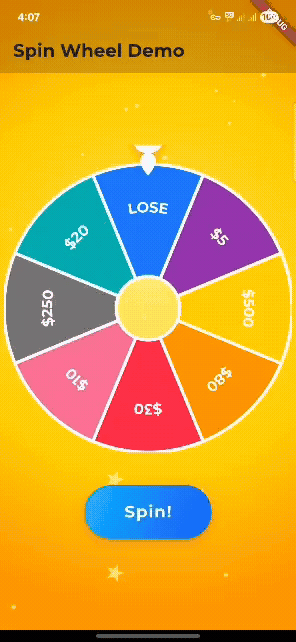

# Spin Wheel Flutter SDK

[](https://github.com/zahir-patel/SpinWheenX)
[](LICENSE)
[](https://www.sdkwala.com)

<!-- Uncomment the line below if the GIF exists in your repo root -->
<!--  -->

A highly customizable, open-source **Flutter spin wheel** widget for Dart and Flutter apps. Perfect for games, promotions, lucky draws, prize wheels, and interactive experiences.

---

## 📚 Table of Contents
- [Features](#-features)
- [Installation](#-installation)
- [Getting Started](#-getting-started)
- [Usage Example](#-usage-example)
- [Folder Structure](#-folder-structure)
- [Vibrant Backgrounds](#-vibrant-backgrounds)
- [Customization](#-customization)
- [Screenshots](#-screenshots)
- [Contributing](#-contributing)
- [License](#-license)
- [Contact & Support](#-contact--support)

---

## 🚀 Features
- Customizable segments: colors, labels, gradients, images, GIFs, Lottie, and more
- Curved, horizontal, or tangential label alignment
- Custom pointer (SVG, shape, or widget) with flexible placement
- Animated spinning with controller and physics
- Sound, confetti, and effects support
- Responsive and cross-platform (Android, iOS, Web, Desktop)
- Easy integration and extension for any Dart/Flutter project
- Open-source and MIT licensed

---

## 📦 Installation
Add to your `pubspec.yaml`:
```yaml
dependencies:
  spin_wheel:
    git:
      url: https://github.com/zahir-patel/SpinWheenX.git
```
Then run:
```sh
flutter pub get
```

---

## 🏁 Getting Started
1. Add the dependency as shown above.
2. Import the package:
   ```dart
   import 'package:spin_wheel/spin_wheel.dart';
   ```
3. See the [Usage Example](#-usage-example) below for a quick start.

---

## 🛠️ Usage Example
```dart
final controller = SpinWheelController();
final labels = [r'$30', r'$10', r'$250', r'$20', 'LOSE', r'$5', r'$500', r'$80'];
final colors = [Colors.yellow, Colors.orange, Colors.red, Colors.pink, Colors.grey, Colors.teal, Colors.blue, Colors.purple];

Stack(
  alignment: Alignment.topCenter,
  children: [
    Padding(
      padding: const EdgeInsets.only(top: 24),
      child: SpinWheel(
        controller: controller,
        config: SpinWheelConfig(
          width: 350,
          height: 350,
          divisions: labels.length,
          labels: labels,
          segmentColors: colors,
          pointerWidget: null, // Pointer is outside the wheel
          centerHoleRadius: 0.22,
          dividerColor: Colors.white,
          dividerThickness: 4,
          labelAlignment: SpinWheelLabelAlignment.curved,
          labelTextStyle: TextStyle(fontSize: 18, color: Colors.white, fontWeight: FontWeight.bold),
          initialSpinAngle: -math.pi / labels.length,
        ),
        onSpinEnd: (selectedIndex) {
          // Handle result
        },
      ),
    ),
    // Custom pointer above the wheel
    Positioned(
      top: -28,
      child: MyPointerWidget(),
    ),
  ],
);
```

---

## 🗂 Folder Structure
```
spin_wheel/
├── example/                # Example/demo Flutter app
├── lib/                    # Main SDK code
│   ├── spin_wheel.dart
│   ├── spin_wheel_config.dart
│   ├── spin_wheel_controller.dart
│   ├── spin_wheel_label_alignment.dart
│   └── spin_wheel_renderer.dart
├── test/                   # Unit/widget tests
├── assets/                 # SDK assets (if any)
├── CHANGELOG.md
├── CONTRIBUTING.md
├── LICENSE
├── README.md
├── pubspec.yaml
└── .gitignore
```

---

## 🌈 Vibrant Backgrounds
For a festive look, use a custom painter or image for the background (see the example app for a starry, radial gradient background). Easily create casino, game show, or lucky draw effects!

---

## ⚙️ Customization
- **Segments:** Set `divisions`, `labels`, `segmentColors`, gradients, images, etc.
- **Pointer:** Use any widget or SVG for the pointer (recommended: place above the wheel).
- **Center:** Adjust `centerHoleRadius` for donut effect.
- **Effects:** Add sounds, confetti, and more.
- **Label Alignment:** Choose from curved, horizontal, tangential, etc.
- **Animation:** Control spin duration, resistance, and curve.

---

## 📸 Screenshots
<!-- If you have demo images, add them here -->
<!--  -->

---

## 🤝 Contributing
Pull requests are welcome! Please open an issue first to discuss major changes.
- Fork the repo
- Create your feature branch (`git checkout -b feature/YourFeature`)
- Commit your changes
- Push to the branch
- Open a pull request

---

## 📄 License
This project is licensed under the MIT License. See [LICENSE](LICENSE) for details.

---

## 💬 Contact & Support
- Author: Zahir Patel
- GitHub: [SpinWheenX](https://github.com/zahir-patel/SpinWheenX.git)
- Issues: Use the GitHub issues tab for bug reports and feature requests.

---

> **Keywords:** Flutter, Dart, spin wheel, prize wheel, lucky draw, game, open-source, widget, casino, animation, customizable, SDK
