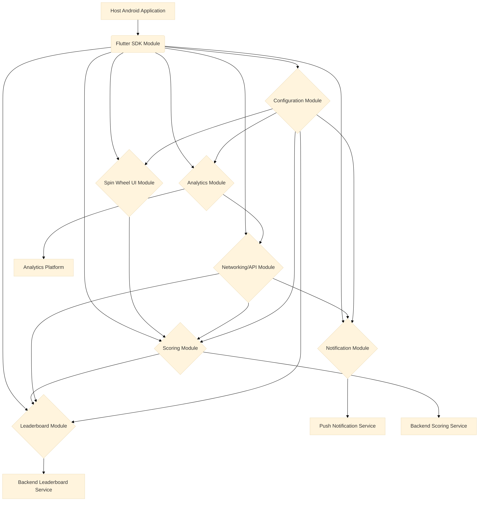

**Flutter-based** **Android** **SDK** **for** **Spin** **Wheel**
**Feature:** **Detailed** **Outline**

**Phase** **:** **Research** **and** **Analyze** **SDK**
**Requirements**

**Existing** **Flutter** **Spin** **Wheel** **Packages** **Analysis**

> **flutter_spinning_wheel**

**Overview:**

The flutter_spinning_wheel package provides a customizable widget for
creating spinning wheels in Flutter applications. It allows for basic
customization of the wheel's appearance and behavior.

**Key** **Features** **and** **Customization** **Options:**

> **Image-based** **Wheel:** The wheel itself is rendered from an image,
> allowing for custom designs. Users can replace the image with their
> preference.
>
> **Dividers:** The number of divisions in the wheel can be specified,
> assuming all divisions are equal.
>
> **Dimensions:** width and height parameters control the size of the
> wheel container.
>
> **Initial** **Spin** **Angle:** initialSpinAngle allows setting an
> initial rotation for the wheel.
>
> **Spin** **Resistance:** spinResistance ( . to . ) influences the speed
> and deceleration of the wheel.
>
> **Interaction** **during** **Spin:** canInteractWhileSpinning
> (boolean) determines if the user can stop the wheel while it's
> spinning.
>
> **Secondary** **Image:** A secondaryImage can be rendered on top of
> the wheel, unaffected by the animation, with customizable
> secondaryImageHeight,
>
> secondaryImageWidth, secondaryImageTop, and secondaryImageLeft for
> fine-tuning its position.
>
> **Callbacks:**
>
> onUpdate(int value): Executed when the selected divider changes during
> the animation.
>
> onEnd(int value): Executed when the animation stops.
>
> **Integration** **with** **Scoring** **(Example):** The example
> demonstrates a basic scoring system using a StreamBuilder and a
> RouletteScore widget, mapping divider values to reward labels (e.g., '
> ′,′ 400'). This is a basic example and would need to be expanded for a
> full SDK.

**Limitations/Considerations** **for** **SDK** **Development:**

> **Image-dependent** **Customization:** While flexible, relying solely
> on images for wheel design might limit dynamic customization of
> individual segment colors, text, or icons without regenerating the
> image. A more programmatic approach for segment rendering would offer
> greater flexibility.
>
> **Basic** **Scoring:** The provided example for scoring is very
> rudimentary. A full SDK would require a more robust and extensible
> scoring system.
>
> **No** **Built-in** **Leaderboards,** **Notifications,** **Analytics:**
> The package focuses purely on the UI widget and does not include any
> features related to leaderboards, notifications, or analytics. These
> would need to be developed as separate components within the SDK.
>
> **Security** **and** **Reliability:** As a UI package, it doesn't
> address security or reliability concerns for an SDK. These aspects
> would need to be handled at the SDK level.
>
> **Documentation:** While the Readme provides basic usage, a
> comprehensive SDK would require extensive documentation for
> developers.
>
> **Dart** **Incompatible:** The package is years old and marked as Dart
>
> incompatible, which is a significant concern for a modern Flutter SDK.

**Conclusion:**

The flutter_spinning_wheel package provides a good starting point for
the core spin wheel UI. However, a complete SDK would require significant
additional development for advanced customization, scoring,
leaderboards, notifications,

analytics, security, reliability, and comprehensive documentation. The
age and Dart

incompatibility of this package suggest that building a new, modern spin
wheel widget from scratch or finding a more actively maintained
alternative might be necessary for a robust SDK.

> **flutter_fortune_wheel**

**Overview:**

The flutter_fortune_wheel package offers highly customizable fortune
wheel widgets for Flutter, supporting mobile, desktop, and web
platforms. It provides more advanced customization options compared to
flutter_spinning_wheel.

**Key** **Features** **and** **Customization** **Options:**

> **Programmatic** **Item** **Definition:** Instead of relying on a
> single image, FortuneItem objects define individual segments of the
> wheel. Each FortuneItem can have a child widget (e.g., Text, Icon) and
> a style
>
> property for fine-grained control over its appearance.
>
> **Individual** **Item** **Styling:** FortuneItemStyle allows
> customization of color (fill color), borderColor, and borderWidth for
> each segment, enabling dynamic visual changes without image
> manipulation.
>
> **Style** **Strategies:** StyleStrategy allows applying common styling
> logic to all items. AlternatingStyleStrategy and UniformStyleStrategy
> are provided, and custom strategies can be implemented.
>
> **Physics-based** **Interaction:** The physics property, which expects
> an implementation of PanPhysics, controls touch and drag input.
>
> CircularPanPhysics (for FortuneWheel) and
> DirectionalPanPhysics.horizontal (for FortuneBar) are available, and
>
> custom PanPhysics subclasses can be created.
>
> **onFling** **Callback:** This callback is triggered when a fling
> gesture is detected, allowing for selection of a new random item.
>
> **Customizable** **Indicators:** FortuneIndicator allows customization
> of the position indicators. TriangleIndicator and RectangleIndicator
> are provided, and custom indicator widgets can be used.
>
> **Fortune** **Bar:** In addition to the circular wheel, a FortuneBar
> widget is provided for scenarios where vertical screen space is
> limited.
>
> **Dart** **Compatible:** This package is actively maintained and
> compatible with Dart .

**Strengths** **for** **SDK** **Development:**

> **High** **Customizability:** The programmatic approach to defining and
> styling wheel segments makes it highly suitable for an SDK that
> requires extensive customization of colors, text, and icons.
>
> **Flexible** **Interaction:** The physics-based interaction and
> onFling callback provide good control over the spinning behavior.
>
> **Active** **Development:** Being Dart compatible and actively
> maintained is a significant advantage for building a modern SDK.
>
> **Cross-Platform** **Support:** Works across mobile, desktop, and web,
> which is beneficial for a versatile SDK.

**Limitations/Considerations** **for** **SDK** **Development:**

> **No** **Built-in** **Scoring,** **Leaderboards,** **Notifications,**
> **Analytics:** Similar to flutter_spinning_wheel, this package focuses
> on the UI component and does
>
> not include features like scoring systems, leaderboards, notifications,
> or analytics. These would need to be integrated separately.
>
> **Security** **and** **Reliability:** The package itself doesn't
> inherently address SDK-level security or reliability concerns.
>
> **Documentation:** While good for a package, an SDK would require more
> comprehensive documentation, including integration guides, API
> references, and best practices.

**Conclusion:**

The flutter_fortune_wheel package is a much stronger candidate for the
core spin wheel UI component of the SDK due to its high customizability,
programmatic approach to segment definition, and active development. It
provides a solid foundation upon which to build the required features
for the SDK, such as advanced customization, scoring, leaderboards,
notifications, analytics, security, and comprehensive documentation.

**Core** **SDK** **Requirements**

Based on the analysis of existing Flutter spin wheel packages and
general mobile SDK best practices, the following core requirements have
been identified for the Flutter-based Android SDK:

**.** **Spin** **Wheel** **Feature** **(Core** **Functionality)**

> **Highly** **Customizable** **UI:**
>
> **Dynamic** **Segment** **Customization:** The SDK must allow for
> programmatic customization of individual wheel segments, including:
>
> **Colors:** Comprehensive control over background, border, and text
> colors for each segment, allowing for any color combination.
>
> **Text:** Support for custom text content within each segment,
> including font, size, color, and styling.
>
> **Icons/Images:** Full flexibility to embed custom icons or images
> (both local assets and remote URLs) within each segment, with options
> for sizing and positioning.
>
> **Wheel** **Appearance:** Control over overall wheel properties such
> as: **Size** **and** **Dimensions:** Adjustable width and height.
>
> **Border:** Customizable border color and width for the entire wheel.
>
> **Background:** Option to set a custom background for the wheel area.
>
> **Indicator** **Customization:** The pointer or indicator that
> highlights the winning segment should be customizable in terms of its
> shape, color, size, and position.
>
> **Animation** **Control:** Fine-grained control over spin animation
> properties, including duration, easing curves, and initial spin angle.
>
> **Interaction:** Ability to configure user interaction, such as
> enabling/disabling manual spinning or flinging.
>
> **Predefined** **Themes** **and** **Customization** **Options:**
>
> The SDK should offer a set of predefined visual themes to allow for
> quick integration and consistent branding.
>
> A clear and intuitive API for applying these themes and overriding
> specific customization options should be provided.
>
> **Reward** **Mechanism:**
>
> A flexible system to define and associate rewards with each wheel
> segment.
>
> Support for various reward types (e.g., points, virtual currency,
> in-app items, discounts).
>
> A callback mechanism to notify the integrating application when a
> reward is won.

**.** **Scoring** **System**

> **Flexible** **Scoring** **Logic:**
>
> The SDK should provide a robust scoring system that can be integrated
> with the spin wheel outcomes.
>
> Ability to define different point values or scoring rules for various
> rewards or segments.
>
> Support for cumulative scoring and session-based scoring.
>
> **Score** **Management** **API:**
>
> APIs for adding, deducting, resetting, and retrieving user scores.
>
> Secure storage of scores to prevent tampering.
>
> **Integration** **with** **External** **Systems:** Potential for
> integration with backend systems for persistent score storage and
> validation.

**.** **Leaderboards**

> **Leaderboard** **Management:**
>
> APIs for submitting scores to a leaderboard.
>
> Retrieval of global and friend-based leaderboards.
>
> Support for different leaderboard types (e.g., daily, weekly,
> all-time).
>
> **User** **Ranking:** Display of user's current rank and position
> relative to others.
>
> **Pagination** **and** **Filtering:** Efficient retrieval of leaderboard
> data, especially for large datasets.
>
> **Security:** Measures to prevent fraudulent scores from being
> submitted to leaderboards.

**.** **Notifications**

> **In-App** **Notifications:**
>
> Ability to trigger customizable in-app notifications based on spin
> wheel outcomes (e.g.,

'You won!', 'Better luck next time!'). \* Customizable notification
content, appearance, and sound. \* **Push** **Notifications**
**(Optional** **but** **Recommended):** \* Integration with push
notification services (e.g., Firebase Cloud Messaging) to send
notifications to users outside the app (e.g., 'Don't forget to spin the
wheel today!'). \* Requires clear opt-in/opt-out mechanisms for users.

**.** **Analytics**

> **Event** **Tracking:**
>
> Automatic tracking of key events related to the spin wheel (e.g.,
> wheel spun, reward won, reward redeemed, customization applied, theme
> changed).
>
> Customizable event parameters to capture relevant data (e.g., reward
> type, spin duration, user ID).
>
> **User** **Engagement** **Metrics:**
>
> Collection of data on user engagement with the spin wheel feature
> (e.g., frequency of spins, average rewards won, time spent).
>
> **Integration** **with** **Analytics** **Platforms:**
>
> Compatibility with popular analytics platforms (e.g., Google Analytics
> for Firebase, Mixpanel) for data visualization and analysis.
>
> APIs for developers to access raw or aggregated analytics data.

**.** **Security**

> **Data** **Protection:**
>
> Secure handling and storage of sensitive user data (e.g., scores,
> reward information).
>
> Encryption of data in transit and at rest where appropriate.
>
> **Fraud** **Prevention:**
>
> Mechanisms to prevent cheating or manipulation of spin wheel outcomes
> and scoring.
>
> Server-side validation of spin results and reward claims.
>
> **API** **Security:**
>
> Secure authentication and authorization for any backend API calls
> (e.g., for leaderboards, persistent scoring).
>
> Protection against common vulnerabilities like injection attacks,
> unauthorized access.
>
> **Obfuscation** **and** **Tamper** **Detection:**
>
> Techniques to make it harder for malicious users to reverse-engineer
> or tamper with the SDK code.

**.** **Reliability**

> **Stability** **and** **Performance:**
>
> The SDK must be stable, crash-free, and performant, even under heavy
> usage.
>
> Efficient resource management to minimize impact on the host
> application.
>
> **Error** **Handling** **and** **Resilience:**
>
> Robust error handling mechanisms to gracefully manage unexpected
> situations (e.g., network issues, invalid configurations).
>
> Offline capabilities or graceful degradation when internet connectivity
> is unavailable.
>
> **Backward** **Compatibility:**
>
> Maintain backward compatibility with previous versions to ensure
> smooth updates for integrating applications.

**.** **Documentation**

> **Comprehensive** **Developer** **Documentation:**
>
> Clear and concise documentation for integrating and using the SDK.
>
> Includes installation guides, API references, code examples, and best
> practices.
>
> Detailed explanations of customization options, scoring logic, and
> integration points.
>
> **Getting** **Started** **Guides:** Step-by-step tutorials for common
> use cases.
>
> **Troubleshooting** **and** **FAQs:** Resources to help developers
> resolve common issues.
>
> **Version** **Control** **and** **Release** **Notes:** Clear
> information on SDK versions, changes, and new features.

**.** **Platform** **Compatibility**

> **Android** **Focus:** While Flutter is cross-platform, the primary
> focus of this SDK is Android, ensuring optimal performance and
> adherence to Android design guidelines.
>
> **Flutter** **Version** **Compatibility:** Clearly state supported
> Flutter and Dart SDK versions.

**Phase** **:** **Design** **SDK** **Architecture** **and**
**Technical** **Specifications**

**Overall** **SDK** **Architecture**

The Flutter-based Android SDK for the spin wheel feature will be
designed with a modular and extensible architecture to ensure
maintainability, scalability, and ease of integration. The SDK will
primarily consist of a Flutter module that can be embedded into existing
Android applications. This approach leverages Flutter's UI capabilities
while allowing seamless integration into native Android environments.

**Key** **Architectural** **Principles:**

> **Modularity:** The SDK will be broken down into distinct,
> self-contained modules, each responsible for a specific set of
> functionalities (e.g., UI, scoring, analytics, networking). This
> promotes separation of concerns and simplifies development and testing.
>
> **Extensibility:** The architecture will be designed to allow for easy
> addition of new features or customization options without requiring
> significant changes to
>
> existing code. This will be achieved through well-defined interfaces,
> abstract classes, and dependency injection.
>
> **Configurability:** The SDK will provide a clear and centralized
> mechanism for configuration, allowing developers to easily
> enable/disable features, set customization parameters, and integrate
> with their backend systems.
>
> **Performance:** Emphasis will be placed on optimizing the SDK's
> performance to ensure smooth animations, responsive UI, and minimal
> impact on the host application's resources.
>
> **Security:** Security considerations will be integrated throughout
> the design process, including secure data handling, API communication,
> and protection against tampering.
>
> **Testability:** The modular design and clear interfaces will
> facilitate comprehensive unit, integration, and UI testing.

**High-Level** **Component** **Diagram:**

**Explanation** **of** **High-Level** **Components:**

> **Host** **Android** **Application:** The native Android application
> that integrates the Flutter SDK module.
>
> **Flutter** **SDK** **Module:** The core Flutter module containing all
> the SDK functionalities. This module will be exposed as a library that
> Android developers can easily add to their projects.
>
> **Spin** **Wheel** **UI** **Module:** Responsible for rendering the
> spin wheel, handling animations, and managing user interactions. This
> module will leverage the
>
> flutter_fortune_wheel package as a foundation, with significant
> enhancements for advanced customization.
>
> **Scoring** **Module:** Manages the scoring logic, including point
> calculation, score storage, and retrieval. It will interact with the
> Networking/API Module for persistent storage and validation.
>
> **Leaderboard** **Module:** Handles the submission and retrieval of
> scores to and from leaderboards. It will communicate with a backend
> leaderboard service via the Networking/API Module.
>
> **Notification** **Module:** Manages in-app notifications and integrates
> with push notification services to deliver timely alerts and reminders
> to users.
>
> **Analytics** **Module:** Tracks user interactions and events within
> the spin wheel feature, sending data to configured analytics platforms.
>
> **Networking/API** **Module:** Provides a secure and standardized way
> for other modules to communicate with backend services for scoring,
> leaderboards, and other data-driven functionalities.
>
> **Configuration** **Module:** Centralizes all SDK configuration
> parameters, including API keys, theme settings, and feature toggles.

**Module** **Breakdown** **and** **Technical** **Specifications**

**.** **Spin** **Wheel** **UI** **Module**

**Purpose:** To provide a highly customizable and interactive spin wheel
widget.

**Key** **Classes/Components:**

> SpinWheelWidget: The main Flutter widget for the spin wheel. It will
> encapsulate the FortuneWheel from flutter_fortune_wheel and extend its
> capabilities.
>
> SpinWheelController: A controller class to programmatically control
> the spin wheel (e.g., start spin, stop spin, set outcome).
>
> SpinWheelTheme: A class defining the visual properties of the spin
> wheel, including colors, fonts, and icon styles. This will support
> predefined themes and custom overrides.
>
> SpinWheelSegment: A data model representing a single segment of the
> spin wheel, including its value, reward, and visual properties.
>
> Reward: A data model representing the reward associated with a spin
> wheel segment.

**Customization** **Technical** **Details:**

> **Segment** **Customization:** Each SpinWheelSegment will expose
> properties for backgroundColor, borderColor, borderWidth, textColor,
> textFont, textSize, iconPath (for local assets), iconUrl (for remote
> assets), and backgroundImagePath or backgroundImageUrl for
> segment-specific
>
> background images.
>
> **Theme** **System:** The SpinWheelTheme will utilize Flutter's
> ThemeData and InheritedWidget concepts to allow for easy application
> of themes and
>
> overriding individual properties. Predefined themes will be provided as
> static instances of SpinWheelTheme.
>
> **Animation:** Leverage Flutter's animation framework (
> AnimationController, Tween, CurvedAnimation) for smooth and
> customizable spin animations. The spinResistance and initialSpinAngle
> from flutter_fortune_wheel will be
>
> exposed and enhanced.
>
> **Interaction:** The canInteractWhileSpinning property will be
> exposed. Additionally, methods will be provided to enable/disable
> touch interaction with the wheel.
>
> **Event** **Callbacks:** onSpinStart, onSpinEnd(SpinWheelSegment
> result), onRewardWon(Reward reward) callbacks will be provided to
> allow the
>
> integrating application to react to spin events and reward outcomes.

**.** **Scoring** **Module**

**Purpose:** To manage user scores and integrate with backend scoring
services.

**Key** **Classes/Components:**

> ScoreManager: A singleton class responsible for managing user scores.
> It will handle score updates, retrieval, and persistence.
>
> ScoreEvent: A data model representing a scoring event (e.g., points
> awarded, points deducted).
>
> ScoreRepository: An abstract class defining the interface for score
> persistence (e.g., local storage, remote server).
>
> LocalScoreRepository: An implementation of ScoreRepository for local
> score storage (e.g., using shared_preferences or sqflite).
>
> RemoteScoreRepository: An implementation of ScoreRepository for
> interacting with a backend scoring service via the Networking/API
> Module.

**Technical** **Details:**

> **Score** **Data** **Model:** Scores will be associated with a userId
> and scoreValue. Additional metadata like timestamp and source (e.g.,
> 'spin_wheel_win') can be included.
>
> **Score** **Persistence:** The ScoreManager will use a ScoreRepository
> to abstract the underlying storage mechanism. This allows for easy
> switching between local and remote storage, or even supporting both
> simultaneously.
>
> **Score** **Validation:** For remote scoring, server-side validation
> will be crucial to prevent cheating. The SDK will provide mechanisms
> to send necessary data for validation to the backend.
>
> **Offline** **Support:** Scores can be temporarily stored locally and
> synchronized with the backend when connectivity is restored.

**.** **Leaderboard** **Module**

**Purpose:** To display user rankings and facilitate competition.

**Key** **Classes/Components:**

> LeaderboardManager: A singleton class for managing leaderboard
> interactions.
>
> LeaderboardEntry: A data model representing a single entry in the
> leaderboard (e.g., userId, username, score, rank).
>
> LeaderboardRepository: An abstract class defining the interface for
> fetching and submitting leaderboard data.
>
> RemoteLeaderboardRepository: An implementation of
> LeaderboardRepository for interacting with a backend leaderboard
> service via
>
> the Networking/API Module.

**Technical** **Details:**

> **Leaderboard** **Types:** Support for different leaderboard scopes
> (e.g., global, friends, daily, weekly). The LeaderboardManager will
> expose methods to query these different types.
>
> **Data** **Fetching:** Leaderboard data will be fetched from the
> backend using the Networking/API Module. Pagination will be
> implemented for efficient retrieval of large leaderboards.
>
> **Real-time** **Updates** **(Optional):** Consider implementing
> real-time updates for leaderboards using WebSockets or similar
> technologies if the backend supports it.
>
> **Security:** All leaderboard submissions will be validated on the
> server-side to prevent fraudulent entries.

**.** **Notification** **Module**

**Purpose:** To deliver timely and relevant notifications to users.

**Key** **Classes/Components:**

> NotificationManager: A singleton class for handling in-app and push
> notifications.
>
> InAppNotification: A data model for in-app notifications, including
> title, message, type (e.g., success, warning), and duration.
>
> PushNotificationService: An interface for integrating with external
> push notification providers (e.g., Firebase Cloud Messaging).

**Technical** **Details:**

> **In-App** **Notifications:** The NotificationManager will provide
> methods to display customizable in-app notifications (e.g., using
> Flutter's SnackBar or custom overlay widgets).
>
> **Push** **Notifications:** The SDK will provide an abstraction layer
> for push notifications. Developers can configure their preferred push
> notification service. The SDK will handle the registration of devices
> and the parsing of incoming notification payloads related to the spin
> wheel feature.
>
> **Customization:** Notification content, appearance, and trigger
> conditions will be configurable.

**.** **Analytics** **Module**

**Purpose:** To track user behavior and collect data for insights.

**Key** **Classes/Components:**

> AnalyticsManager: A singleton class for tracking events and user
> properties.
>
> AnalyticsEvent: A data model for analytics events, including eventName
> and properties (key-value pairs).
>
> AnalyticsProvider: An abstract class defining the interface for
> integrating with different analytics platforms.
>
> FirebaseAnalyticsProvider: An implementation of AnalyticsProvider for
> Google Analytics for Firebase.
>
> CustomAnalyticsProvider: A generic implementation allowing developers
> to integrate their own analytics solutions.

**Technical** **Details:**

> **Event** **Tracking:** The AnalyticsManager will provide a simple API
> to log events (e.g., logEvent('spin_wheel_spun', {'reward_type':
> 'points', 'value': 100})).
>
> **User** **Properties:** Ability to set user properties (e.g.,
> setUserId, setUserProperty('has_spun_wheel', true)).
>
> **Provider-based** **Integration:** The AnalyticsManager will use an
> AnalyticsProvider to send data to the configured analytics platform.
> This
>
> allows for easy switching or integration with multiple platforms.
>
> **Data** **Privacy:** Ensure compliance with data privacy regulations
> (e.g., GDPR, CCPA) by providing options for user consent and data
> anonymization.

**.** **Networking/API** **Module**

**Purpose:** To handle secure communication with backend services.

**Key** **Classes/Components:**

> ApiClient: A class responsible for making HTTP requests to backend
> endpoints.
>
> AuthInterceptor: An interceptor for adding authentication tokens to
> API requests.
>
> ErrorInterceptor: An interceptor for handling API errors and network
> issues.
>
> ApiConfig: A class for configuring API endpoints and authentication
> details.

**Technical** **Details:**

> **HTTP** **Client:** Use a robust HTTP client library (e.g., dio or
> http package) for making network requests.
>
> **Authentication:** Support for various authentication mechanisms
> (e.g., API keys, OAuth tokens). The AuthInterceptor will ensure that
> all authenticated requests include the necessary credentials.
>
> **Error** **Handling:** Centralized error handling for network
> requests, including retries, timeouts, and clear error messages.
>
> **Data** **Serialization/Deserialization:** Use json_serializable or
> similar packages for efficient and type-safe handling of JSON data.
>
> **Security:** Implement HTTPS for all API communication. Validate SSL
> certificates. Avoid storing sensitive information directly in the SDK.
> Consider token refresh mechanisms.

**.** **Configuration** **Module**

**Purpose:** To provide a centralized and easy-to-use configuration
interface for the SDK.

**Key** **Classes/Components:**

> SpinWheelSdkConfig: A class containing all configurable parameters for
> the SDK.
>
> SpinWheelSdkInitializer: A utility class for initializing the SDK with
> the provided configuration.

**Technical** **Details:**

> **Initialization:** The SDK will be initialized via a single
> SpinWheelSdkInitializer.initialize(SpinWheelSdkConfig config) method.
>
> **Configuration** **Parameters:** The SpinWheelSdkConfig will include
> parameters such as:
>
> apiKey: For authenticating with backend services.
>
> baseUrl: Base URL for API endpoints.
>
> defaultTheme: The default theme to apply to the spin wheel.
>
> enableAnalytics: Boolean to enable/disable analytics tracking.
>
> enableLeaderboards: Boolean to enable/disable leaderboard features.
>
> debugMode: Boolean to enable/disable debug logging.
>
> **Validation:** Input validation for configuration parameters to ensure
> correct usage.

**Phase** **:** **Detailed** **Implementation** **Outline**

This section provides a detailed implementation outline for each module
of the Flutter-based Android SDK. It covers the specific steps,
technologies, and considerations for developing each component, building
upon the architectural design established in Phase .

**.** **Spin** **Wheel** **UI** **Module** **Implementation**

**Objective:** To develop a highly customizable and interactive spin
wheel widget using Flutter.

**Implementation** **Steps:**

> . **Project** **Setup:**
>
> Create a new Flutter module project ( flutter create --template=module
> spin_wheel_sdk).
>
> Add flutter_fortune_wheel as a dependency in pubspec.yaml.
>
> Set up asset folders for default images/icons.
>
> . **Core** **SpinWheelWidget** **Development:**
>
> Create the SpinWheelWidget class, extending StatelessWidget or
> StatefulWidget as needed for internal state management.
>
> Integrate flutter_fortune_wheel.FortuneWheel as the underlying UI
> component.
>
> Expose key properties from FortuneWheel (e.g., selected, items,
> physics, indicators) through the SpinWheelWidget constructor.
>
> Implement onSpinStart and onSpinEnd callbacks to notify the
> integrating application.

. **SpinWheelController** **Implementation:**

> Create a SpinWheelController class using StreamController to manage
> the selected stream for FortuneWheel.
>
> Provide methods like spin(int selectedIndex) to programmatically
> trigger a spin to a specific segment.
>
> Add methods to control animation properties (e.g., setDuration,
> setCurve).

. **SpinWheelSegment** **and** **Reward** **Data** **Models:**

> Define SpinWheelSegment with properties for value, reward,
> backgroundColor, borderColor, borderWidth, textColor, textFont,
> textSize, iconPath, and iconUrl.
>
> Define Reward with properties like id, type, value, and description.
>
> Implement fromJson and toJson methods for
> serialization/deserialization if segments need to be loaded from
> configuration or remote sources.

. **Customization** **and** **Theming** **(** **SpinWheelTheme):**

> Create SpinWheelTheme class with properties for global wheel styling
> (e.g., default segment colors, text styles, indicator styles).
>
> Implement a mechanism (e.g., ThemeData and Theme.of(context)) to allow
> the SpinWheelWidget to inherit theme properties.
>
> Provide static factory methods for predefined themes (e.g.,
> SpinWheelTheme.light, SpinWheelTheme.dark, SpinWheelTheme.carnival).
>
> Ensure that individual SpinWheelSegment properties can override theme
> properties for fine-grained control.
>
> . **Indicator** **Customization:**
>
> Expose properties in SpinWheelWidget to allow customization of the
> FortuneIndicator.
>
> Provide default TriangleIndicator and RectangleIndicator with
> customizable colors, sizes, and elevations.
>
> Allow developers to pass their own custom Widget for the indicator.
>
> . **Asset** **Management:**
>
> Provide clear guidelines for including custom images/icons in the host
> application's assets.
>
> Implement logic to load assets from both local paths and remote URLs.
>
> . **Example** **Usage** **and** **Demo** **Application:**
>
> Develop a comprehensive example application within the SDK project to
> demonstrate all customization options and features.
>
> Include various scenarios, such as different themes, custom segments,
> and interaction types.

**.** **Scoring** **Module** **Implementation**

**Objective:** To implement a flexible and secure scoring system.

**Implementation** **Steps:**

> . **ScoreManager** **Development:**
>
> Create ScoreManager as a singleton class to ensure a single instance
> manages scores.
>
> Implement methods for addScore(int value), deductScore(int value),
> getScore(), resetScore(), and setUserId(String userId).
>
> Use StreamController or ValueNotifier to broadcast score changes to
> listeners.
>
> . **ScoreRepository** **Abstraction:**
>
> Define abstract class ScoreRepository with methods like
> saveScore(String userId, int score), getScore(String userId), and
> clearScore(String userId).
>
> . **LocalScoreRepository** **Implementation:**
>
> Implement LocalScoreRepository using shared_preferences for simple
> key-value storage of scores.
>
> Consider sqflite for more complex local data storage if needed for
> historical scores or detailed transaction logs.
>
> . **RemoteScoreRepository** **Implementation:**
>
> Implement RemoteScoreRepository to interact with the backend scoring
> service via the Networking/API Module.
>
> Define API endpoints for POST /scores (to submit scores) and GET
> /scores/{userId} (to retrieve scores).
>
> Implement request and response models for score data.
>
> Crucially, implement server-side validation logic to prevent score
> manipulation. The SDK will send relevant data (e.g., rewardId,
>
> spinTimestamp, clientHash) to the backend for verification.
>
> . **Score** **Synchronization** **and** **Offline** **Support:**
>
> Implement logic in ScoreManager to synchronize local scores with the
> remote server when connectivity is available.
>
> Queue score updates when offline and send them in batches once online.

**.** **Leaderboard** **Module** **Implementation**

**Objective:** To enable display and submission of scores to
leaderboards.

**Implementation** **Steps:**

> . **LeaderboardManager** **Development:**
>
> Create LeaderboardManager as a singleton.
>
> Implement methods like submitScore(String userId, int score, String
> leaderboardType) and getLeaderboard(String leaderboardType, {int
> limit, int offset}).
>
> Provide methods to get a user's rank ( getUserRank(String userId,
> String leaderboardType)).
>
> . **LeaderboardRepository** **Abstraction:**
>
> Define abstract class LeaderboardRepository with methods for
> fetchLeaderboard and postScore.
>
> . **RemoteLeaderboardRepository** **Implementation:**
>
> Implement RemoteLeaderboardRepository to communicate with the backend
> leaderboard service via the Networking/API Module.
>
> Define API endpoints for GET /leaderboards/{type} and POST
> /leaderboards.
>
> Implement pagination for fetching large leaderboards.
>
> . **Leaderboard** **UI** **Components** **(Optional,** **but**
> **recommended** **for** **SDK):**
>
> Provide pre-built Flutter widgets for displaying leaderboards (e.g.,
> LeaderboardListWidget, UserRankWidget).
>
> These widgets should be customizable to match the host application's
> UI.
>
> . **Security** **Considerations:**
>
> Emphasize that all score submissions to the leaderboard must be
> validated on the backend to prevent cheating. The SDK will facilitate
> sending necessary data for this validation.

**.** **Notification** **Module** **Implementation**

**Objective:** To provide flexible in-app and push notification
capabilities.

**Implementation** **Steps:**

> . **NotificationManager** **Development:**
>
> Create NotificationManager as a singleton.
>
> Implement showInAppNotification(InAppNotification notification)
> method.
>
> Implement schedulePushNotification(PushNotification notification) and
> cancelPushNotification(String notificationId).
>
> . **In-App** **Notification** **UI:**
>
> Develop a custom Flutter overlay widget or utilize existing Flutter
> components (e.g., SnackBar, showDialog) for displaying in-app
> notifications.
>
> Ensure notifications are customizable (text, color, icon, duration).
>
> . **Push** **Notification** **Integration:**
>
> **Android** **Setup:** Provide clear instructions for setting up
> Firebase Cloud Messaging (FCM) in the host Android application.
>
> **SDK-side** **FCM** **Handling:** The SDK will include logic to:
> Initialize FCM and obtain the device token.
>
> Register the device token with the backend (if required for targeted
> notifications).
>
> Handle incoming FCM messages related to the spin wheel feature (e.g.,
> parsing data payloads, triggering local notifications).
>
> **Abstraction:** Use an abstract class PushNotificationService to
> allow for other push notification providers if needed in the future.

**.** **Analytics** **Module** **Implementation**

**Objective:** To track user interactions and events for data-driven
insights.

**Implementation** **Steps:**

> . **AnalyticsManager** **Development:**
>
> Create AnalyticsManager as a singleton.
>
> Implement logEvent(String eventName, Map\<String, dynamic\>
> properties) method.
>
> Implement setUserId(String userId) and setUserProperty(String key,
> dynamic value).
>
> . **AnalyticsProvider** **Abstraction:**
>
> Define abstract class AnalyticsProvider with methods like logEvent,
> setUserId, setUserProperty.
>
> . **FirebaseAnalyticsProvider** **Implementation:**
>
> Implement FirebaseAnalyticsProvider using the firebase_analytics
> Flutter package.
>
> Map SDK events and properties to Firebase Analytics events and user
> properties.
>
> . **CustomAnalyticsProvider** **Implementation:**
>
> Provide a generic CustomAnalyticsProvider that allows developers to
> inject their own analytics logging function.
>
> This enables integration with any analytics platform not directly
> supported by the SDK.
>
> . **Event** **Definitions:**
>
> Define a clear set of standard events to be tracked (e.g.,
> spin_wheel_spun, reward_won, theme_changed, leaderboard_viewed).
>
> Specify recommended properties for each event.
>
> . **Data** **Privacy:**
>
> Include mechanisms for developers to enable/disable analytics tracking
> based on user consent (e.g., GDPR compliance).
>
> Provide options for anonymizing data where necessary.

**.** **Networking/API** **Module** **Implementation**

**Objective:** To provide secure and reliable communication with backend
services.

**Implementation** **Steps:**

. **HTTP** **Client** **Setup:**

> Use the dio package for robust HTTP client capabilities (interceptors,
> retries, error handling).
>
> Configure Dio instance with baseUrl, connectTimeout, receiveTimeout.

. **ApiClient** **Development:**

> Create ApiClient class with methods for get, post, put, delete
> requests.
>
> Handle common HTTP status codes and throw custom exceptions for API
> errors.

. **Interceptors:**

> **AuthInterceptor:** Intercept requests to add authentication headers
> (e.g., Bearer Token). The token will be provided during SDK
> initialization or
>
> fetched from a secure storage.
>
> **ErrorInterceptor:** Intercept responses to handle API errors,
> network issues, and refresh expired tokens.
>
> **LoggingInterceptor:** (For debug builds) Log request and response
> details for debugging purposes.

. **Data** **Serialization/Deserialization:**

> Use json_serializable and build_runner for automatic code generation
> of fromJson and toJson methods for all data models (e.g.,
>
> SpinWheelSegment, Reward, LeaderboardEntry).

. **Security** **Best** **Practices:**

> **HTTPS** **Enforcement:** Ensure all API calls use HTTPS.
>
> **Certificate** **Pinning** **(Advanced):** Consider implementing
> certificate pinning for enhanced security against Man-in-the-Middle
> attacks, especially for highly sensitive data.
>
> **Token** **Management:** Securely store and refresh authentication
> tokens (e.g., using Flutter Secure Storage for Android).
>
> **Input** **Validation:** Validate all data sent to and received from
> the API.

**.** **Configuration** **Module** **Implementation**

**Objective:** To provide a centralized and easy-to-use configuration
interface.

**Implementation** **Steps:**

> . **SpinWheelSdkConfig** **Definition:**
>
> Define SpinWheelSdkConfig class with all configurable parameters (e.g.,
> apiKey, baseUrl, defaultTheme, enableAnalytics, enableLeaderboards,
> debugMode).
>
> Use final fields and a constructor for immutability.
>
> . **SpinWheelSdkInitializer** **Development:**
>
> Create SpinWheelSdkInitializer with a static
> initialize(SpinWheelSdkConfig config) method.
>
> This method will:
>
> Validate the provided configuration.
>
> Initialize all SDK modules (e.g., ScoreManager, LeaderboardManager,
> AnalyticsManager) with the appropriate configurations.
>
> Set up the ApiClient with the baseUrl and apiKey.
>
> Perform any necessary platform-specific initialization (e.g., FCM
> setup).
>
> . **Configuration** **Validation:**
>
> Implement robust validation logic within initialize to ensure all
> required parameters are provided and are in a valid format.
>
> Throw descriptive exceptions for invalid configurations.

**.** **Android** **Native** **Integration** **Layer**

**Objective:** To ensure seamless integration of the Flutter module into
native Android applications.

**Implementation** **Steps:**

> . **Flutter** **Module** **as** **a** **Library:**
>
> Configure the Flutter module to be built as an Android Archive (AAR)
> file.
>
> Provide instructions on how to include the AAR in an Android project's
> build.gradle.
>
> . **Platform** **Channels** **(if** **necessary):**
>
> If there are specific Android-only functionalities that cannot be
> achieved directly in Flutter (e.g., very deep system integrations,
> specific hardware access), use Flutter Platform Channels.
>
> Define method channels to communicate between Flutter and native
> Android code.
>
> Implement the native Android side of the platform channels
> (Kotlin/Java).
>
> . **Android** **Manifest** **Configuration:**
>
> Provide clear instructions for necessary Android Manifest permissions
> (e.g., INTERNET, ACCESS_NETWORK_STATE, RECEIVE_BOOT_COMPLETED for
>
> notifications).
>
> Guide developers on adding necessary FCM services or other Android
> components.
>
> . **Resource** **Management:**
>
> Ensure that Flutter assets and resources are correctly bundled and
> accessible within the Android application.

**Phase** **:** **Develop** **Security** **and** **Analytics**
**Framework**

This phase focuses on outlining the robust security measures and
comprehensive analytics framework essential for a reliable and
insightful SDK. These aspects are critical for protecting user data,
preventing abuse, and providing valuable insights into SDK usage and
user engagement.

**.** **Security** **Framework**

**Objective:** To ensure the SDK is secure, protects user data, and
prevents fraudulent activities.

**Key** **Security** **Principles:**

> **Defense** **in** **Depth:** Employ multiple layers of security
> controls to protect against various threats.
>
> **Least** **Privilege:** Ensure the SDK and its components operate
> with the minimum necessary permissions.
>
> **Secure** **by** **Design:** Integrate security considerations from
> the initial design phase, rather than as an afterthought.
>
> **Transparency:** Clearly communicate data collection and usage
> practices to developers and end-users.

**Implementation** **Details:**

> . **Data** **Protection** **and** **Privacy:**
>
> **Data** **Minimization:** Collect only the data absolutely necessary
> for the SDK's functionality.
>
> **Encryption:**
>
> **Data** **in** **Transit:** All communication between the SDK and
> backend services (e.g., for scoring, leaderboards, analytics) MUST use
> HTTPS/TLS to encrypt data in transit. This prevents eavesdropping and
> Man-in-the-Middle (MITM) attacks.
>
> **Data** **at** **Rest:** Sensitive data stored locally on the device
> (e.g., cached scores, user preferences) should be encrypted using
> platform-specific secure storage mechanisms (e.g., Android Keystore for
> encryption keys, Flutter Secure Storage for encrypted preferences).
>
> **GDPR/CCPA** **Compliance:** Provide clear mechanisms for developers
> to obtain user consent for data collection and processing, especially
> for analytics and personalized notifications. Implement features for
> data deletion and access requests if applicable.
>
> . **Fraud** **Prevention** **and** **Anti-Tampering:**
>
> **Server-Side** **Validation:** This is the most critical component of
> fraud prevention. All sensitive operations, especially score
> submissions and reward claims, MUST be validated on a trusted backend
> server. The SDK will send sufficient context (e.g., spinId,
> selectedSegmentIndex, timestamp,
>
> clientHash) to the server for verification. The server should
> independently determine the spin outcome and reward based on its own
> logic and data.
>
> **Obfuscation** **and** **Minification:** Apply code obfuscation and
> minification techniques to the Flutter module and any native Android
> code. This makes reverse engineering more difficult, deterring casual
> attackers.
>
> **Root/Jailbreak** **Detection** **(Optional** **but**
> **Recommended):** Implement checks to detect if the device is rooted
> or jailbroken. While not foolproof, this can provide an additional
> layer of defense and allow the SDK to adjust its behavior (e.g.,
> disable certain features or log warnings) on compromised devices.
>
> **Signature** **Verification:** Verify the integrity of the SDK's own
> code and assets at runtime to detect any unauthorized modifications.
>
> **Rate** **Limiting:** Implement rate limiting on API calls from the
> SDK to prevent abuse and denial-of-service attacks against backend
> services.

. **API** **Security:**

> **Authentication** **and** **Authorization:**
>
> Use secure authentication mechanisms (e.g., API keys, OAuth .
>
> tokens) for all backend API calls. API keys should be securely stored
> and rotated regularly.
>
> Implement proper authorization checks on the backend to ensure the SDK
> only performs actions it is permitted to do.
>
> **Input** **Validation:** Strictly validate all input received from
> the SDK on the backend to prevent injection attacks (e.g., SQL
> injection, XSS).
>
> **Secure** **Token** **Management:** If using tokens (e.g., JWTs),
> ensure they are short-lived, refreshed securely, and stored in secure
> locations (e.g.,
>
> FlutterSecureStorage on the client, HTTP-only cookies or secure
> server-side storage on the backend).
>
> **API** **Key** **Protection:** Provide clear guidance to developers
> on how to securely store API keys (e.g., using environment variables,
> Gradle secrets, or
>
> a secure backend service) and prevent them from being hardcoded or
> exposed in public repositories.
>
> . **Error** **Handling** **and** **Logging:**
>
> Implement secure logging practices. Avoid logging sensitive user data
> or API keys. Use appropriate log levels.
>
> Ensure error messages do not expose sensitive internal information or
> stack traces to the end-user or to publicly accessible logs.

**.** **Analytics** **Framework**

**Objective:** To provide comprehensive event tracking and user insights
without compromising privacy.

**Key** **Analytics** **Principles:**

> **Actionable** **Insights:** Focus on collecting data that can drive
> improvements in user engagement, feature adoption, and monetization.
>
> **Privacy** **by** **Design:** Integrate privacy considerations into
> the analytics framework from the outset.
>
> **Flexibility:** Allow developers to choose their preferred analytics
> platform and customize event tracking.

**Implementation** **Details:**

> . **Event** **Taxonomy** **and** **Standardization:**
>
> Define a clear and consistent event taxonomy for all tracked events.
> This ensures data consistency and ease of analysis.
>
> **Core** **Events:**
>
> spin_wheel_initialized: When the spin wheel widget is first displayed.
>
> spin_started: When a user initiates a spin.
>
> spin_completed: When the spin animation finishes.
>
> reward_won: When a user wins a reward.
>
> reward_redeemed: When a won reward is successfully redeemed (requires
> integration with host app's reward system).
>
> customization_applied: When a user applies a custom theme or changes
> wheel appearance.
>
> leaderboard_viewed: When a user views a leaderboard.
>
> score_submitted: When a score is submitted to the backend.
>
> **Event** **Properties:** For each event, define relevant properties to
> capture context. For example, reward_won might include reward_type,
>
> reward_value, segment_index, spin_duration.

. **Analytics** **Provider** **Integration:**

> The AnalyticsManager will act as an abstraction layer, allowing
> developers to plug in different analytics providers.
>
> **FirebaseAnalyticsProvider:** Provide a robust implementation for
> Google Analytics for Firebase, which is a common choice for mobile
> apps. This will involve mapping SDK events to Firebase events and user
> properties.
>
> **CustomAnalyticsProvider:** Offer a generic provider interface where
> developers can supply a callback function to receive all SDK events.
> This allows integration with any custom or third-party analytics
> system (e.g., Mixpanel, Amplitude, custom backend logging).

. **User** **Identification:**

> The SDK will allow developers to set a userId (e.g., their internal
> user ID) to enable cross-device tracking and personalized analytics.
>
> If no userId is provided, the SDK should use an anonymous device ID
> for tracking.

. **Data** **Collection** **and** **Transmission:**

> Events will be collected locally and then batched and sent to the
> configured analytics provider to minimize network overhead and battery
> consumption.
>
> Implement retry mechanisms for failed transmissions.
>
> Allow for offline event queuing, where events are stored locally and
> sent once connectivity is restored.
>
> . **Debugging** **and** **Testing** **Analytics:**
>
> Provide a debugMode flag in the SDK configuration that enables verbose
> logging of analytics events to the console. This helps developers
> verify that events are being tracked correctly.
>
> Offer tools or instructions for using analytics platform debug views
> (e.g., Firebase DebugView) to see events in real-time.
>
> . **Performance** **Considerations:**
>
> Ensure analytics tracking does not introduce significant performance
> overhead or block the UI thread.
>
> Use asynchronous operations for data transmission.

**Phase** **:** **Design** **Documentation** **and** **Testing**
**Strategy**

This phase outlines the comprehensive documentation and rigorous testing
strategies crucial for the SDK's usability, reliability, and adoption.
Well-structured documentation empowers developers to integrate the SDK
efficiently, while a robust testing strategy ensures its stability and
performance across various Android environments.

**.** **Documentation** **Strategy**

**Objective:** To provide clear, comprehensive, and accessible
documentation that enables developers to easily integrate, customize,
and troubleshoot the SDK.

**Key** **Documentation** **Principles:**

> **Developer-Centric:** Focus on the needs of the integrating
> developer, providing practical guidance and actionable examples.
>
> **Accuracy** **and** **Completeness:** Ensure all information is
> correct, up-to-date, and covers all aspects of the SDK.
>
> **Clarity** **and** **Conciseness:** Use plain language, avoid jargon
> where possible, and present information efficiently.
>
> **Accessibility:** Organize content logically with clear headings,
> tables, and code blocks for easy readability.
>
> **Version** **Control:** Maintain documentation alongside the SDK
> code, with clear versioning and release notes.

**Documentation** **Components:**

> . **Getting** **Started** **Guide:**
>
> **Introduction:** Brief overview of the SDK's purpose and key
> features.
>
> **Prerequisites:** List of required software (Flutter SDK, Android
> Studio, etc.) and minimum versions.
>
> **Installation:** Step-by-step instructions for adding the Flutter SDK
> module to an existing Android project (e.g., adding to pubspec.yaml,
> configuring
>
> build.gradle for AAR import).
>
> **Initialization:** Clear instructions and code examples for
> initializing the SDK with SpinWheelSdkInitializer and
> SpinWheelSdkConfig.
>
> **Basic** **Usage:** A simple, runnable code example demonstrating how
> to display a basic spin wheel and handle a spin outcome.
>
> . **API** **Reference** **(DartDoc):**
>
> Automatically generated documentation from the SDK's source code using
> DartDoc.
>
> Detailed descriptions of all public classes, methods, properties, and
> enums.
>
> Includes parameter descriptions, return values, and potential
> exceptions.
>
> Examples for each major API call.
>
> . **Customization** **Guide:**
>
> **Theming:** Explain how to use predefined themes and how to create
> custom themes using SpinWheelTheme.
>
> **Segment** **Customization:** Detailed guide on customizing
> individual SpinWheelSegment properties (colors, text, icons/images).
>
> **Indicator** **Customization:** Instructions for changing the spin
> wheel indicator's appearance.
>
> **Animation** **Control:** How to adjust spin duration, curves, and
> other animation properties.
>
> **Event** **Handling:** Comprehensive explanation of all available
> callbacks
>
> ( onSpinStart, onSpinEnd, onRewardWon) and how to implement them.

. **Feature-Specific** **Guides:**

> **Scoring** **System** **Integration:** How to use ScoreManager to
> update and retrieve scores, and integrate with backend scoring
> services.
>
> **Leaderboard** **Integration:** Guide on submitting scores to
> leaderboards and displaying leaderboard data using provided UI
> components or custom implementations.
>
> **Notification** **Usage:** How to trigger in-app notifications and
> integrate with push notification services (FCM setup, handling
> payloads).
>
> **Analytics** **Integration:** Instructions for configuring analytics
> providers and understanding the tracked events and properties.

. **Advanced** **Topics:**

> **Security** **Best** **Practices:** Recommendations for securing the
> host application when integrating the SDK (e.g., protecting API keys,
> server-side validation).
>
> **Offline** **Support:** How the SDK handles offline scenarios for scoring
> and analytics.
>
> **Performance** **Optimization:** Tips for ensuring optimal
> performance when using the SDK.
>
> **Platform** **Channels** **(if** **applicable):** Detailed
> explanation and examples for any platform-specific integrations.

. **Troubleshooting** **and** **FAQs:**

> Common issues and their solutions.
>
> Debugging tips for SDK integration and behavior.
>
> Frequently asked questions.

. **Release** **Notes** **and** **Versioning:**

> A clear changelog for each SDK version, detailing new features, bug
> fixes, and breaking changes.
>
> Semantic versioning (e.g., MAJOR.MINOR.PATCH) will be followed.

**Documentation** **Tools:**

> **Markdown:** For writing all conceptual and guide documentation.
>
> **DartDoc:** For generating API reference documentation directly from
> source code comments.
>
> **Static** **Site** **Generator** **(e.g.,** **Jekyll,** **MkDocs):**
> To compile Markdown and DartDoc into a browsable, searchable
> documentation website.

**.** **Testing** **Strategy**

**Objective:** To ensure the SDK is reliable, performant, secure, and
compatible across a range of Android devices and Flutter versions.

**Key** **Testing** **Principles:**

> **Automated** **Testing:** Prioritize automated tests (unit, widget,
> integration) to ensure rapid feedback and prevent regressions.
>
> **Comprehensive** **Coverage:** Aim for high test coverage across all
> modules and functionalities.
>
> **Real-World** **Scenarios:** Test the SDK in scenarios that mimic
> real-world usage patterns and edge cases.
>
> **Performance** **Testing:** Measure and optimize the SDK's
> performance to ensure it doesn't negatively impact the host
> application.
>
> **Security** **Testing:** Actively test for vulnerabilities and
> potential exploits.

**Testing** **Levels** **and** **Methodologies:**

> . **Unit** **Tests:**
>
> **Scope:** Individual functions, methods, and classes within each
> module (e.g., ScoreManager methods, SpinWheelController logic, data
> model serialization).
>
> **Framework:** Flutter's built-in test package.
>
> **Methodology:** Write isolated tests for each unit, mocking
> dependencies as needed.
>
> . **Widget** **Tests:**
>
> **Scope:** UI components of the SpinWheelWidget and any provided
> leaderboard/notification widgets.
>
> **Framework:** Flutter's flutter_test package.
>
> **Methodology:** Test widget rendering, state changes, user
> interactions (taps, gestures), and animations. Verify that
> customization options are applied correctly.

. **Integration** **Tests:**

> **Scope:** Interactions between different modules within the SDK (e.g.,
> SpinWheelWidget interacting with ScoreManager, AnalyticsManager
>
> sending events to a provider).
>
> **Framework:** Flutter's integration_test package.
>
> **Methodology:** Simulate end-to-end user flows within the SDK. Test
> network calls, data persistence, and cross-module communication.

. **Android** **Platform-Specific** **Tests:**

> **Scope:** The Android native integration layer, platform channels,
> and Android Manifest configurations.
>
> **Framework:** Android JUnit, Espresso (for native UI interactions if
> any).
>
> **Methodology:** Verify that the Flutter module is correctly embedded,
> platform channels function as expected, and necessary Android
> permissions are handled.

. **Performance** **Testing:**

> **Metrics:** Frame rate (FPS), CPU usage, memory consumption, battery
> usage, app size.
>
> **Tools:** Flutter DevTools, Android Studio Profiler.
>
> **Methodology:** Run the SDK on various Android devices (emulators and
> physical devices) and measure performance under different loads (e.g.,
> rapid spins, multiple concurrent features). Identify and address
> performance bottlenecks.

. **Security** **Testing:**

> **Vulnerability** **Scanning:** Use automated tools to scan for common
> vulnerabilities in the SDK's codebase.
>
> **Penetration** **Testing:** Conduct manual penetration tests to
> identify potential exploits (e.g., data tampering, unauthorized access
> to backend APIs).
>
> **Fuzz** **Testing:** Provide malformed inputs to the SDK to test its
> robustness and error handling.
>
> **Static** **Application** **Security** **Testing** **(SAST):**
> Analyze source code for security flaws.
>
> **Dynamic** **Application** **Security** **Testing** **(DAST):** Test
> the running application for vulnerabilities.

. **Compatibility** **Testing:**

> **Android** **Versions:** Test the SDK on a range of Android OS
> versions (e.g., API
>
> +).
>
> **Device** **Fragmentation:** Test on various device manufacturers,
> screen sizes, and resolutions.
>
> **Flutter** **Versions:** Ensure compatibility with a defined range of
> Flutter SDK versions.

. **Manual** **Testing** **and** **User** **Acceptance** **Testing**
**(UAT):**

> **Scope:** Overall user experience, visual correctness, and adherence
> to requirements.
>
> **Methodology:** Integrate the SDK into a sample host application and
> perform manual tests. Engage potential users or internal teams for UAT
> to gather feedback on usability and functionality.

. **Continuous** **Integration/Continuous** **Deployment** **(CI/CD):**

> Integrate all automated tests into a CI/CD pipeline (e.g., GitHub
> Actions, GitLab CI, Jenkins).
>
> Automatically run tests on every code commit to catch regressions
> early.
>
> Automate the build and release process for new SDK versions.
